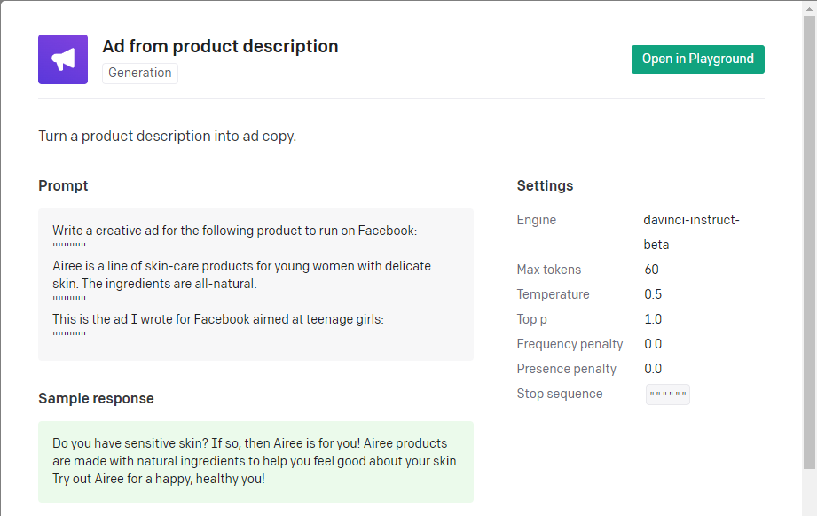
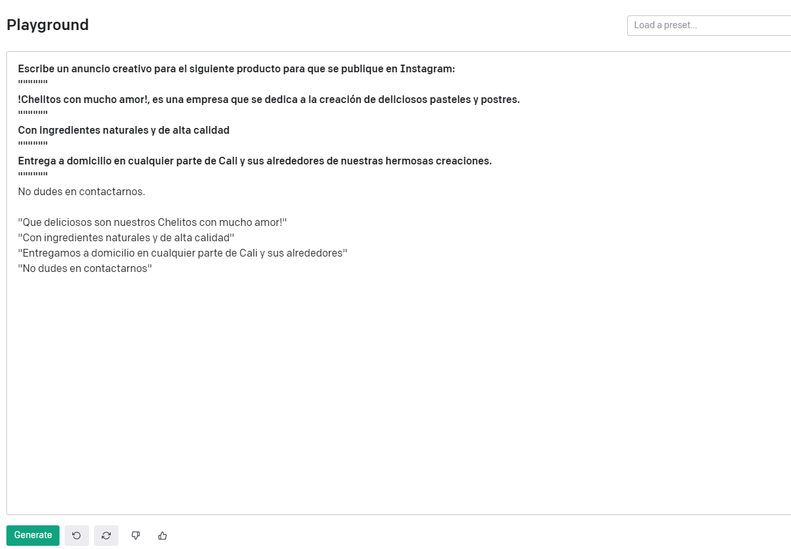
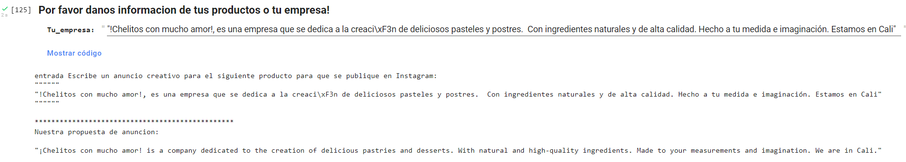
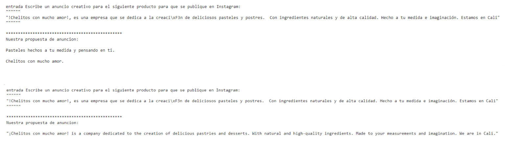
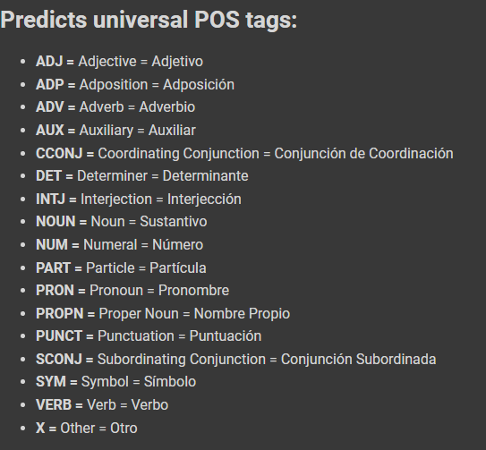

# **Mini Proyecto 2: Procesamiento De Lenguaje Natural Usando Transformers**
## **Diseñado por:**
* *Carlos Arbey Mejia Martinez*
    * **Código:** 2210549
* *Andres Felipe Guerra Vargas* 
    * **Código:** 2211058

# **Introducción**

El lenguaje es una herramienta de expresión que nos permite tener relación en nuestra vida social y profesional. Es un medio para transmitir ideas, información, opiniones, sentimientos, entre otras acciones. 

El Procesamiento del Lenguaje Natural o NLP es una disciplina que se encuentra en la intersección de varias ciencias, tales como las ciencias de la computación, la inteligencia artificial y la psicología cognitiva. Su idea central es la de darle a las máquinas la capacidad de leer y comprender los idiomas que hablamos los humanos.

# **Marco Teórico** ##

* **DataSet:** Directorio donde se registró todos los archivos para el proyecto.

* **Natural Language Processing:** La PNL es un campo de la lingüística y el aprendizaje automático centrado en comprender todo lo relacionado con el lenguaje humano. El objetivo de las tareas de PNL, no es solo comprender palabras individuales, sino también poder comprender el contexto de esas palabras, por ejemplo:

  * **Clasificación de oraciones completas:** Obtener el sentimiento de una revisión, detectar si un correo electrónico es spam, determinar si una oración es gramaticalmente correcta o si dos oraciones están relacionadas lógicamente o no.

  * **Clasificar cada palabra en una oración:** Identificar los componentes gramaticales de una oración (sustantivo, verbo, adjetivo) o las identidades nombradas (persona, ubicación, organización).

  * **Generación de contenido de texto:** Completar un mensaje con texto generado automáticamente, completar los espacios en blanco en un texto con palabras enmascaradas.

  * **Extraer una respuesta de un texto:** Dada una pregunta y un contexto, extraer la respuesta a la pregunta en función de la información proporcionada en el contexto.

  * **Generar una nueva oración a partir de un texto de entrada:** Traducir un texto a otro idioma, resumir un texto.


# **Descripción del problema a solucionar (Punto 1)**

Realice un prototipo de aplicación en colab con la API del modelo GPT-3 recientemente liberado por Open AI (https://openai.com/). Algunas
instrucciones de uso en el siguiente video:
https://www.youtube.com/watch?v=C1eOiOkD_8A (La mejor INTELIGENCIA
ARTIFICIAL Generadora de TEXTO (y la puedes USAR) | GPT-3)

**Nuestro problema:**

Nuestro problema o solución será utilizar un modelo preentrenado de **OpenAI**, el cual nos permita dada una información de un cliente o producto, poder generar un anuncio para Instagram, el cual puede utilizar el cliente en su red social.

## **Planteamiento de la solución (Punto 1)**

Inicialmente buscamos el modelo que nos puede ayudar en los ejemplos que ofrece **OpenAI** en su repositorio, el cual se puede encontrar https://beta.openai.com/playground/p/default-ad-product-description?model=davinci-instruct-beta
Este es un modelo **davinci** tipo instruct, el cual dada unas instrucciones iniciales nos genera la salida que necesitamos.

En nuestro caso la instrucción que siempre tendrán nuestras peticiones será:
```python
"Escribe un anuncio creativo para el siguiente producto para que se publique en Instagram:"
```

Para nuestro modelo se debe también establecer una cadena de finalización la cual será:
```python
"\"\"\"\"\"\""
```

Por lo que un ejemplo de nuestra instrucción de llamado a la api de **OpenAI** se verá de la siguiente manera:
```python
response = openai.Completion.create(
  engine="davinci-instruct-beta",
  prompt="Escribe un anuncio creativo para el siguiente producto para que se publique en Instagram:\n\"\"\"\"\"\"\n!Chelitos con mucho amor!, es una empresa que se dedica a la creación de deliciosos pasteles y postres.\n\"\"\"\"\"\"\n""",
  temperature=0.5,
  max_tokens=60,
  top_p=1,
  frequency_penalty=0,
  presence_penalty=0,
  stop=["\"\"\"\"\"\""]
)
```
Como primer paso de nuestra solución, lo que hicimos fue probar el modelo que nos ofrece **OpenAI** en su opción de **playgorund** para validar si el modelo es capaz de solucionar nuestro problema y si es también capaz de soporte nuestro lenguaje **Español**.

<p align="center">

</p> 

Validada la solución en el sitio de **OpenAI** procedimos a utilizar el código que se nos ofrece, donde implementamos una función python que nos permite utilizar las cadenas de entrada del cliente para así procesarlas y retornar el anuncio. Esta función dinámicamente integra la instrucción respectiva del modelo para que así pueda devolvernos la salida esperada, concatenando al final de la información del cliente nuestro carácter de finalización.

Nuestro modelo fue limitado a un total de 100 tokens dado que el cobro que se realiza se da por cantidad de tokens y modelo seleccionado.

A continuación, se muestra un ejemplo de llamado de nuestro prototipo:
<p align="center">

</p> 

## **Resultados (Punto 1)**

Después de implementar nuestro prototipo y generar diferentes iteraciones de este sobre la misma información ingresada, se pudo evidenciar que nos daba diferentes resultados, algunos coherentes, algunos muy originales y también en algunos casos pudimos evidenciar anuncios en el idioma inglés.

A continuación, mostramos diferentes salidas que nos mostró el prototipo por la misma información proporcionada como parámetro:

<p align="center">

</p> 

# **Descripción del problema a solucionar (Punto 2)**

Seleccione un data set para una aplicación de PLN o de otra fuente y realice lo siguiente:

* Explique el problema o la aplicación que se va a resolver
* Entrene un modelo basado en Deep Learning para el problema seleccionado. Este modelo puede ser entrenado desde cero o usando un modelo pre-entrenado haciendo uso de transfer learning o fine tuning (puede usar la librería Hugging Face)
* Valide el funcionamiento del modelo obtenido.

## **Planteamiento de la solución (Punto 2)**

* **Problema a Resolver:** Se utilizará la librería **FLAIR** de la empresa **Zalando Research**, para acceder a funcionalidades de procesamiento de lenguaje natural utilizando **HuggingFace ModelHub** en tres ejemplos:

1. Análisis Morfo - Sintáctico: Etiquetador de Lenguaje Universal.

2. Reconocimiento de Identidades: Reconoce un grupo de clases.

3. Análisis de Opinión: Frases si son positivas o negativas.

## **Resultados (Punto 2)**

1. Análisis Morfo - Sintáctico: Se verifican las etiquetas de salida.

<p align="center">

</p>

Español:

La <DET> especialización <NOUN> de <ADP> inteligencia <NOUN> artificial <ADJ> de <ADP> la <DET> Universidad <PROPN> Autonoma <PROPN> de <ADP> Occidente <PROPN> es <VERB> la <DET> mejor <ADJ> . <PUNCT> Gracias <PROPN> Jesús <PROPN> . <PUNCT>

Francés:

Grand <ADJ> débat <NOUN> national <ADJ> : <PUNCT> suivez <VERB> Emmanuel <PROPN> Macron <PROPN> en <ADP> direct <NOUN> de <ADP> Bordeaux <PROPN> . <PUNCT>

Alemán:

Hier <ADV> an <ADP> der <DET> Zufahrt <NOUN> zur <ADP> Startrampe <NOUN> 39A <PROPN> , <PUNCT> wo <ADV> vor <ADP> 50 <NUM> Jahren <NOUN> die <DET> gigantischen <ADJ> Saturn-Raketen <NOUN> der <DET> Apollo-Mondmissionen <NOUN> im <ADJ> Schneckentempo <NOUN> vorbeigefahren <VERB> sind <AUX> , <PUNCT> prangen <VERB> nun <ADV> die <DET> blauen <ADJ> Lettern <NOUN> des <DET> Raumfahrtunternehmens <NOUN> von <ADP> Elon <PROPN> Musk <PROPN> an <ADP> einem <DET> Hangar <NOUN> . <PUNCT>
   
2. Reconocimiento de Identidades: Modelo NER rápido de 4 clases para ingles, tags:
   
PER = Person Name = Nombre Persona
LOC = Location Name = Nombre del Lugar
ORG = Organization Name = Nombre Organización
MISC = Other Name = Otro Nombre

The autonomous university of the occidente is in Cali <S-LOC> , it has the best teachers . Jesus <S-PER> , Carlos <S-PER> and Andres <S-PER> .

Span [9]: "Cali"   [− Labels: LOC (0.9861)]

Span [17]: "Jesus"   [− Labels: PER (0.9788)]

Span [19]: "Carlos"   [− Labels: PER (0.9949)]

Span [21]: "Andres"   [− Labels: PER (0.9831)]
   
3. Análisis de Opinión: Clasificador de sentimientos:
   
La frase 'William is happy!' es [POSITIVE (0.9978)]

La frase 'Don't ever go to this restaurant. The food was horrible :-(' es [NEGATIVE (1.0)]
   
Con la libreria **FastText**, podemos crear datasets de texto, con sus respetivas etiquetas. Despues del entrenamiento, el resultado fue el siguiente:
   
**Frase:** Which baking dish is best to bake a banana bread?
   
**Ubicación de la etiqueta:**
   (('__label__baking',
  '__label__equipment',
  '__label__bread',
  '__label__bananas'),
 array([1.00001001, 0.97967768, 0.97632056, 0.8872146 ]))
   
**Embedding:** Los vectores en el Natural Language Processing son elementos matemáticos que poseen 2 características: longitud y orientación, y están ubicados en planos multidimensionales. Esto significa que un vector puede ser analizado tanto por lo que mide de largo como por hacia donde está apuntando.

Los vectores que representan palabras con significados similares se ubican más cerca entre sí, y el significado de cada palabra  viene dado por su respectivo entorno.

Al ser elementos matemáticos, los vectores pueden ser sometidos a  operaciones matemáticas como suma, resta, entre otras. Además, se les puede modificar sus dimensiones y sus perspectivas.
   
**Embedding Glove:** Utiliza 100 dimensiones.
   
**Frase:** The grass is green.
   
Token: 1 The

tensor([-0.0382, -0.2449,  0.7281, -0.3996,  0.0832,  0.0440, -0.3914,  0.3344,
        -0.5755,  0.0875,  0.2879, -0.0673,  0.3091, -0.2638, -0.1323, -0.2076,
         0.3340, -0.3385, -0.3174, -0.4834,  0.1464, -0.3730,  0.3458,  0.0520,
         0.4495, -0.4697,  0.0263, -0.5415, -0.1552, -0.1411, -0.0397,  0.2828,
         0.1439,  0.2346, -0.3102,  0.0862,  0.2040,  0.5262,  0.1716, -0.0824,
        -0.7179, -0.4153,  0.2033, -0.1276,  0.4137,  0.5519,  0.5791, -0.3348,
        -0.3656, -0.5486, -0.0629,  0.2658,  0.3020,  0.9977, -0.8048, -3.0243,
         0.0125, -0.3694,  2.2167,  0.7220, -0.2498,  0.9214,  0.0345,  0.4674,
         1.1079, -0.1936, -0.0746,  0.2335, -0.0521, -0.2204,  0.0572, -0.1581,
        -0.3080, -0.4162,  0.3797,  0.1501, -0.5321, -0.2055, -1.2526,  0.0716,
         0.7056,  0.4974, -0.4206,  0.2615, -1.5380, -0.3022, -0.0734, -0.2831,
         0.3710, -0.2522,  0.0162, -0.0171, -0.3898,  0.8742, -0.7257, -0.5106,
        -0.5203, -0.1459,  0.8278,  0.2706])

Token: 2 grass

tensor([-0.8135,  0.9404, -0.2405, -0.1350,  0.0557,  0.3363,  0.0802, -0.1015,
        -0.5478, -0.3537,  0.0734,  0.2587,  0.1987, -0.1433,  0.2507,  0.4281,
         0.1950,  0.5346,  0.7424,  0.0578, -0.3178,  0.9436,  0.8145, -0.0824,
         0.6166,  0.7284, -0.3262, -1.3641,  0.1232,  0.5373, -0.5123,  0.0246,
         1.0822, -0.2296,  0.6039,  0.5541, -0.9610,  0.4803,  0.0022,  0.5591,
        -0.1637, -0.8468,  0.0741, -0.6216,  0.0260, -0.5162, -0.0525, -0.1418,
        -0.0161, -0.4972, -0.5534, -0.4037,  0.5096,  1.0276, -0.0840, -1.1179,
         0.3226,  0.4928,  0.9488,  0.2040,  0.5388,  0.8397, -0.0689,  0.3136,
         1.0450, -0.2267, -0.0896, -0.6427,  0.6443, -1.1001, -0.0096,  0.2668,
        -0.3230, -0.6065,  0.0479, -0.1664,  0.8571,  0.2335,  0.2539,  1.2546,
         0.5472, -0.1980, -0.7186,  0.2076, -0.2587, -0.3650,  0.0834,  0.6932,
         0.1574,  1.0931,  0.0913, -1.3773, -0.2717,  0.7071,  0.1872, -0.3307,
        -0.2836,  0.1030,  1.2228,  0.8374])

Token: 3 is

tensor([-0.5426,  0.4148,  1.0322, -0.4024,  0.4669,  0.2182, -0.0749,  0.4733,
         0.0810, -0.2208, -0.1281, -0.1144,  0.5089,  0.1157,  0.0282, -0.3628,
         0.4382,  0.0475,  0.2028,  0.4986, -0.1007,  0.1327,  0.1697,  0.1165,
         0.3135,  0.2571,  0.0928, -0.5683, -0.5297, -0.0515, -0.6733,  0.9253,
         0.2693,  0.2273,  0.6636,  0.2622,  0.1972,  0.2609,  0.1877, -0.3454,
        -0.4263,  0.1398,  0.5634, -0.5691,  0.1240, -0.1289,  0.7248, -0.2610,
        -0.2631, -0.4360,  0.0789, -0.8415,  0.5160,  1.3997, -0.7646, -3.1453,
        -0.2920, -0.3125,  1.5129,  0.5243,  0.2146,  0.4245, -0.0884, -0.1780,
         1.1876,  0.1058,  0.7657,  0.2191,  0.3582, -0.1164,  0.0933, -0.6248,
        -0.2190,  0.2180,  0.7406, -0.4374,  0.1434,  0.1472, -1.1605, -0.0505,
         0.1268, -0.0144, -0.9868, -0.0913, -1.2054, -0.1197,  0.0478, -0.5400,
         0.5246, -0.7096, -0.3253, -0.1346, -0.4131,  0.3343, -0.0072,  0.3225,
        -0.0442, -1.2969,  0.7622,  0.4635])

Token: 4 green

tensor([-6.7907e-01,  3.4908e-01, -2.3984e-01, -9.9652e-01,  7.3782e-01,
        -6.5911e-04,  2.8010e-01,  1.7287e-02, -3.6063e-01,  3.6955e-02,
        -4.0395e-01,  2.4092e-02,  2.8958e-01,  4.0497e-01,  6.9992e-01,
         2.5269e-01,  8.0350e-01,  4.9370e-02,  1.5562e-01, -6.3286e-03,
        -2.9414e-01,  1.4728e-01,  1.8977e-01, -5.1791e-01,  3.6986e-01,
         7.4582e-01,  8.2689e-02, -7.2601e-01, -4.0939e-01, -9.7822e-02,
        -1.4096e-01,  7.1121e-01,  6.1933e-01, -2.5014e-01,  4.2250e-01,
         4.8458e-01, -5.1915e-01,  7.7125e-01,  3.6685e-01,  4.9652e-01,
        -4.1298e-02, -1.4683e+00,  2.0038e-01,  1.8591e-01,  4.9860e-02,
        -1.7523e-01, -3.5528e-01,  9.4153e-01, -1.1898e-01, -5.1903e-01,
        -1.1887e-02, -3.9186e-01, -1.7479e-01,  9.3451e-01, -5.8931e-01,
        -2.7701e+00,  3.4522e-01,  8.6533e-01,  1.0808e+00, -1.0291e-01,
        -9.1220e-02,  5.5092e-01, -3.9473e-01,  5.3676e-01,  1.0383e+00,
        -4.0658e-01,  2.4590e-01, -2.6797e-01, -2.6036e-01, -1.4151e-01,
        -1.2022e-01,  1.6234e-01, -7.4320e-01, -6.4728e-01,  4.7133e-02,
         5.1642e-01,  1.9898e-01,  2.3919e-01,  1.2550e-01,  2.2471e-01,
         8.2613e-01,  7.8328e-02, -5.7020e-01,  2.3934e-02, -1.5410e-01,
        -2.5739e-01,  4.1262e-01, -4.6967e-01,  8.7914e-01,  7.2629e-01,
         5.3862e-02, -1.1575e+00, -4.7835e-01,  2.0139e-01, -1.0051e+00,
         1.1515e-01, -9.6609e-01,  1.2960e-01,  1.8388e-01, -3.0383e-02])

Token: 5 .

tensor([-0.3398,  0.2094,  0.4635, -0.6479, -0.3838,  0.0380,  0.1713,  0.1598,
         0.4662, -0.0192,  0.4148, -0.3435,  0.2687,  0.0446,  0.4213, -0.4103,
         0.1546,  0.0222, -0.6465,  0.2526,  0.0431, -0.1945,  0.4652,  0.4565,
         0.6859,  0.0913,  0.2188, -0.7035,  0.1679, -0.3508, -0.1263,  0.6638,
        -0.2582,  0.0365, -0.1361,  0.4025,  0.1429,  0.3813, -0.1228, -0.4589,
        -0.2528, -0.3043, -0.1121, -0.2618, -0.2248, -0.4455,  0.2991, -0.8561,
        -0.1450, -0.4909,  0.0083, -0.1749,  0.2752,  1.4401, -0.2124, -2.8435,
        -0.2796, -0.4572,  1.6386,  0.7881, -0.5526,  0.6500,  0.0864,  0.3901,
         1.0632, -0.3538,  0.4833,  0.3460,  0.8417,  0.0987, -0.2421, -0.2705,
         0.0453, -0.4015,  0.1139,  0.0062,  0.0367,  0.0185, -1.0213, -0.2081,
         0.6407, -0.0688, -0.5864,  0.3348, -1.1432, -0.1148, -0.2509, -0.4591,
        -0.0968, -0.1795, -0.0634, -0.6741, -0.0689,  0.5360, -0.8777,  0.3180,
        -0.3924, -0.2339,  0.4730, -0.0288])
 
**Embedding FLAIR:** Especifica cuantos token tiene la frase a continuación:
   
**Frase:** The grass is green.

[Sentence: "The grass is green ."   [− Tokens: 5]]
   
**Embedding FLAIR combined with BERT:** Suma de los vectores de los dos tipos de embedding:
   
**Frase:** The grass is green.

Token: 1 The
   
tensor([ 0.6800,  0.2429,  0.0012,  ...,  0.7343, -0.0732,  0.1896])

Token: 2 grass
   
tensor([ 2.9200e-01,  2.2066e-02,  4.5290e-05,  ...,  9.8494e-01,
        -5.7341e-01,  6.8033e-01])

Token: 3 is
   
tensor([-0.5447,  0.0229,  0.0078,  ..., -0.2840, -0.1061, -0.0851])

Token: 4 green
   
tensor([0.1477, 0.1097, 0.0009,  ..., 0.0203, 0.5680, 0.0867])

Token: 5 .
   
tensor([-1.5555e-01,  6.7598e-03,  5.3829e-06,  ..., -4.0763e-01,
         1.7429e-01,  3.1956e-02])
   
# **Conclusiones**

* Después de explorar las diferentes opciones de ejemplos que nos ofrece **OpenAI** con esta liberación de su api GPT3, se puede reafirmar el gran potencial que tienen estos modelos para dar solución a estos problemas como los NLP, en nuestro prototipo utilizamos nuestro lenguaje español y aunque se pudo evidenciar buenos resultados, encontramos que en algunas ocasiones se generaban información sin coherencia o en el idioma inglés, lo que nos puede demostrar que por ahora estos modelos pueden llegar a ser más precisos en el idioma inglés. En la exploración del api se pudo evidenciar una muy interesante **Python to natural language** la cual permite explicar código python en lenguaje natural y no técnico, lamentablemente es una opción privada a aun no liberada que sería interesante explorar en el futuro.

* Al utilizar los mecanismos **NLP**, observamos que, dependiendo de la capacidad de entrenamiento de nuestros modelos, estos se hacen más eficientes cuando se genera un dataset más dinámico y su arquitectura de aprendizaje, contiene más argumentos de valoración y extensión de sus argumentos programados. Depende mucho de la experiencia del profesional encargado de satisfacer los requerimientos del modelo optimo.

* Cuando se utilizan los Embedding, observamos que de manera independiente dan buenos resultados, pero, cuando se manejan de forma binaria con otros embedding, se vuelven modelos muy eficientes, porque aprovechan la virtud de cada uno en el procesamiento de su arquitectura de aprendizaje.

## **Referencias:** ##
   
* [OpenAI](https://beta.openai.com/overview)
* [Huggingface-upos](https://huggingface.co/flair/upos-multi-fast)
* [Huggingface-ner](https://huggingface.co/flair/ner-english-fast)
* [fasttext](https://fasttext.cc/docs/en/supervised-tutorial.html)
* [flairNLP-tut1](https://github.com/flairNLP/flair/blob/master/resources/docs/TUTORIAL_3_WORD_EMBEDDING.md)
* [flairNLP-tut4](https://github.com/flairNLP/flair/blob/master/resources/docs/TUTORIAL_4_ELMO_BERT_FLAIR_EMBEDDING.md)
* [iaarbook](https://iaarbook.github.io/procesamiento-del-lenguaje-natural/)
